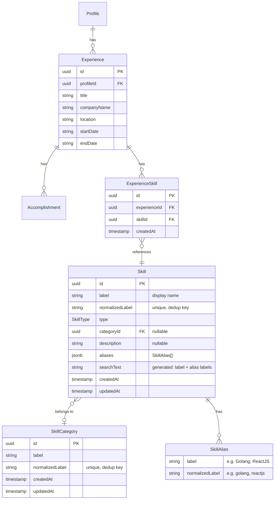

# Skills Domain — Design Spec

## Execution Plan

| # | Block | Plan | Status | Session | Notes |
|---|---|---|---|---|---|
| 1 | Domain Model | [Block 1](../plans/2026-04-12-skills-block1-domain-model.md) | `DONE` | 36e5c0d | Foundation: entities, enum, ports, normalizeLabel |
| 2 | Domain Tables + Repos | [Block 2](../plans/2026-04-12-skills-block2-tables-repositories.md) | `DONE` | 138f407 | pg_trgm, GIN index, integration tests |
| 3a | MIND Source Import | [Block 3a](../plans/2026-04-12-skills-block3a-mind-import.md) | `DONE` | 9b05ee8 | 3,333 skills + concepts + relations |
| 3b | Linguist Source Import | [Block 3b](../plans/2026-04-12-skills-block3b-linguist-import.md) | `DONE` | be2638b | 500+ programming languages |
| 3c | Tanova Source Import | [Block 3c](../plans/2026-04-12-skills-block3c-tanova-import.md) | `DONE` | cefc658 | ~100 skills with relationships |
| 4 | Skills Sync Pipeline | [Block 4](../plans/2026-04-12-skills-block4-sync-pipeline.md) | `TODO` | — | Cross-source dedup + merge. Prereqs done (bd6b166): slug normalizeLabel, drop ordinal, 11 categories |
| 5 | Application Layer | [Block 5](../plans/2026-04-12-skills-block5-application-layer.md) | `DONE` | 6588c39 | Use cases + DTOs |
| 6 | API Layer | [Block 6](../plans/2026-04-12-skills-block6-api-layer.md) | `TODO` | — | Routes + DI wiring |
| 7 | Web Layer | [Block 7](../plans/2026-04-12-skills-block7-web-layer.md) | `TODO` | — | Skill picker UI |

### Execution order

```
1 → 2 → { 3a, 3b, 3c } (parallel) → 4 → 5 → 6 → 7
         ↘ 5 can start after 1 (no infra dependency)
```

**Parallelism opportunities:**
- Blocks 3a, 3b, 3c are fully independent — run in parallel sessions
- Block 5 depends only on Block 1 — can start as soon as Block 1 is done, in parallel with Blocks 2/3

---

## Context

TailoredIn needs structured/standardized skills for technologists, software engineers, and engineering leaders. Multiple external data sources (ESCO, MIND, GitHub Linguist, Tanova) will be selectively synced into domain-level Skill entities. **No external source is ever referenced outside the infrastructure layer.**

First use case: users add skills to their experiences on the profile page.

---

## Data Sources

### ESCO (already imported)

- **13,939 skills** total. Digital collection: 1,284. Transversal: 95.
- Programming languages present as `knowledge / sector-specific`: Java, Python, C++, TypeScript, JavaScript, Ruby, Scala, Swift, SQL, etc.
- **Gaps**: no Go, Rust, Kotlin, React, Vue, Docker, Kubernetes, AWS, Azure, GCP, Terraform, GraphQL, Redis, MongoDB, CI/CD, microservices, PyTorch, etc.
- Best subset for tech: digital collection + transversal skills.
- Has `altLabels` (pipe-delimited alternate names).

### MIND Tech Ontology (`MIND-TechAI/MIND-tech-ontology`)

- **3,333 skills** + 974 concepts + 10,897 relations. JSON format.
- Categories: Programming Languages, Markup, Frameworks, Libraries, Databases, Protocols, Tools, Services.
- Has `synonyms` field (alternate names including common misspellings).
- Has `technicalDomains` (backend, frontend, mobile, DevOps, data science, AI/ML, cybersecurity).
- Has `impliesKnowingSkills` dependency graph (e.g., Next.js implies React implies JavaScript).
- **Best source for modern tech skills.** Covers React, Docker, K8s, AWS, Terraform, etc.

### GitHub Linguist (`github-linguist/linguist`)

- **500+ languages** in YAML. Types: programming, markup, data, prose.
- Has `aliases` field (e.g., golang for Go).
- Has `color` (hex code — useful for UI).
- **Most exhaustive list of programming languages**, but no frameworks or tools.

### Tanova Skills Taxonomy (`tanova-ai/skills-taxonomy`)

- **~100 skills** in JSON. Mix of tech, business, marketing, creative.
- Has `aliases`, `category`, `subcategory`, `parent_skills`, `child_skills`, `related_skills`.
- Has `transferability` score and `proficiency_levels`.
- Smallest dataset but well-structured with relationships.

### Source comparison

| Source | Count | Tech coverage | Aliases | Hierarchy | Format |
|---|---|---|---|---|---|
| ESCO | 13,939 | Partial (gaps in modern tools) | altLabels | 4-level + groups | CSV (imported to PG) |
| MIND | 3,333 | Excellent (modern tech focus) | synonyms | implies-knowledge graph | JSON |
| Linguist | 500+ | Languages only (exhaustive) | aliases | type/group | YAML |
| Tanova | ~100 | Light | aliases | parent/child graph | JSON |

---

## Infrastructure: Source Tables

Each source gets its own scoped tables in infrastructure. All follow the existing ESCO import pattern: raw `INSERT ... ON CONFLICT DO UPDATE`, batched at 500 rows, with Zod validation on input.

**Column naming rule**: source table columns use the **source-native field names** (camelCase → snake_case). ID columns are **prefixed with the source name** to avoid confusion with domain `skill.id`.

### ESCO tables (existing)

Already imported — 14 tables prefixed `esco_`. Primary key is `concept_uri`. See `infrastructure/src/esco/` for details.

### MIND tables

Source: JSON files in `skills/` directory (per-category: `programming_languages.json`, `frameworks_frontend.json`, etc.) and `concepts/` directory. Also available as `__aggregated_skills.json`.

Fields vary by skill type — libraries have `supported_programming_languages`, `specific_to_frameworks`, etc. that programming languages don't. We store the union of all fields, nullable.

```sql
-- Skills (aggregated from all skills/*.json files)
CREATE TABLE "mind_skills" (
    "mind_name"                        text NOT NULL,  -- PK: source "name" field (e.g. "React", "Java")
    "mind_type"                        jsonb NOT NULL,  -- ["ProgrammingLanguage"] or ["Framework"] — always array
    "synonyms"                         jsonb DEFAULT '[]',
    "technical_domains"                jsonb DEFAULT '[]',
    "implies_knowing_skills"           jsonb DEFAULT '[]',
    "implies_knowing_concepts"         jsonb DEFAULT '[]',
    "conceptual_aspects"               jsonb DEFAULT '[]',
    "architectural_patterns"           jsonb DEFAULT '[]',
    "supported_programming_languages"  jsonb DEFAULT '[]',  -- for libraries/frameworks
    "specific_to_frameworks"           jsonb DEFAULT '[]',  -- for libraries
    "adapter_for_tool_or_service"      jsonb DEFAULT '[]',  -- for libraries
    "implements_patterns"              jsonb DEFAULT '[]',  -- for libraries
    "associated_to_application_domains" jsonb DEFAULT '[]',
    "solves_application_tasks"         jsonb DEFAULT '[]',  -- for libraries
    "build_tools"                      jsonb DEFAULT '[]',  -- for languages
    "runtime_environments"             jsonb DEFAULT '[]',  -- for languages
    "mind_source_file"                 text NOT NULL,       -- which JSON file this came from (e.g. "programming_languages")
    "mind_version"                     text NOT NULL,       -- git commit hash
    "created_at"                       timestamptz NOT NULL DEFAULT CURRENT_TIMESTAMP,
    "updated_at"                       timestamptz NOT NULL DEFAULT CURRENT_TIMESTAMP,
    CONSTRAINT "mind_skills_pkey" PRIMARY KEY ("mind_name")
);

-- Concepts (from concepts/*.json files)
CREATE TABLE "mind_concepts" (
    "mind_name"                        text NOT NULL,  -- PK: source "name" field
    "mind_type"                        text NOT NULL,  -- source file category: "architectural_patterns", "application_tasks", etc.
    "synonyms"                         jsonb DEFAULT '[]',
    "mind_version"                     text NOT NULL,
    "created_at"                       timestamptz NOT NULL DEFAULT CURRENT_TIMESTAMP,
    "updated_at"                       timestamptz NOT NULL DEFAULT CURRENT_TIMESTAMP,
    CONSTRAINT "mind_concepts_pkey" PRIMARY KEY ("mind_name")
);

-- Relations (derived from impliesKnowingSkills / impliesKnowingConcepts arrays)
CREATE TABLE "mind_relations" (
    "mind_source_name"                 text NOT NULL,
    "mind_target_name"                 text NOT NULL,
    "relation_type"                    text NOT NULL,  -- "impliesKnowingSkills", "impliesKnowingConcepts"
    "mind_version"                     text NOT NULL,
    "created_at"                       timestamptz NOT NULL DEFAULT CURRENT_TIMESTAMP,
    CONSTRAINT "mind_relations_pkey" PRIMARY KEY ("mind_source_name", "mind_target_name", "relation_type")
);
```

### Linguist tables

Source: single YAML file `lib/linguist/languages.yml`. Each key is the language name.

```sql
CREATE TABLE "linguist_languages" (
    "linguist_name"      text NOT NULL,           -- YAML key (e.g. "JavaScript", "C++")
    "linguist_type"      text NOT NULL,           -- "programming", "markup", "data", "prose"
    "color"              text,                    -- hex code, e.g. "#f1e05a"
    "aliases"            jsonb DEFAULT '[]',      -- ["js", "node"]
    "extensions"         jsonb DEFAULT '[]',      -- [".js", ".mjs", ".jsx"]
    "interpreters"       jsonb DEFAULT '[]',      -- ["node", "nodejs"]
    "tm_scope"           text,                    -- TextMate scope
    "ace_mode"           text,                    -- Ace editor mode
    "codemirror_mode"    text,
    "codemirror_mime_type" text,
    "linguist_language_id" integer,               -- GitHub's internal numeric ID
    "linguist_group"     text,                    -- group name if this is a variant (e.g. "C" for Objective-C)
    "linguist_version"   text NOT NULL,           -- git commit hash
    "created_at"         timestamptz NOT NULL DEFAULT CURRENT_TIMESTAMP,
    "updated_at"         timestamptz NOT NULL DEFAULT CURRENT_TIMESTAMP,
    CONSTRAINT "linguist_languages_pkey" PRIMARY KEY ("linguist_name")
);
```

### Tanova tables

Source: single `taxonomy.json` with nested structure. Skills are under `categories.<category>.<subcategory>.skills[]`.

```sql
CREATE TABLE "tanova_skills" (
    "tanova_id"          text NOT NULL,           -- source "id" field (e.g. "javascript", "docker")
    "canonical_name"     text NOT NULL,           -- source "canonical_name"
    "category"           text,                    -- source "category" (e.g. "technology")
    "subcategory"        text,                    -- source "subcategory" (e.g. "programming_languages")
    "tags"               jsonb DEFAULT '[]',      -- ["frontend", "backend", "web"]
    "description"        text,
    "aliases"            jsonb DEFAULT '[]',      -- ["JS", "ECMAScript"]
    "parent_skills"      jsonb DEFAULT '[]',      -- tanova IDs
    "child_skills"       jsonb DEFAULT '[]',      -- tanova IDs
    "related_skills"     jsonb DEFAULT '[]',      -- tanova IDs
    "transferability"    jsonb,                   -- { "typescript": 0.95, "python": 0.6 }
    "proficiency_levels" jsonb,                   -- { beginner: {...}, intermediate: {...}, ... }
    "typical_roles"      jsonb DEFAULT '[]',
    "industry_demand"    text,                    -- "very_high", "high", "medium", "low"
    "prerequisites"      jsonb DEFAULT '[]',      -- tanova IDs
    "tanova_version"     text NOT NULL,           -- git commit hash
    "created_at"         timestamptz NOT NULL DEFAULT CURRENT_TIMESTAMP,
    "updated_at"         timestamptz NOT NULL DEFAULT CURRENT_TIMESTAMP,
    CONSTRAINT "tanova_skills_pkey" PRIMARY KEY ("tanova_id")
);
```

### File structure

```
infrastructure/
├── esco/              ← existing (14 tables, importer, parser, entities, schemas)
├── mind/              ← new
│   ├── entities/      ← MindSkillEntity, MindConceptEntity, MindRelationEntity
│   ├── schemas/       ← Zod schemas for JSON validation
│   ├── MindImporter.ts
│   ├── MindDatasetParser.ts
│   └── index.ts
├── linguist/          ← new
│   ├── entities/      ← LinguistLanguageEntity
│   ├── schemas/       ← Zod schema for YAML validation
│   ├── LinguistImporter.ts
│   ├── LinguistParser.ts
│   └── index.ts
├── tanova/            ← new
│   ├── entities/      ← TanovaSkillEntity
│   ├── schemas/       ← Zod schemas for JSON validation
│   ├── TanovaImporter.ts
│   ├── TanovaDatasetParser.ts
│   └── index.ts
└── scripts/
    ├── esco-import.ts      ← existing
    ├── mind-import.ts      ← new: bun mind:import <path-to-repo>
    ├── linguist-import.ts  ← new: bun linguist:import <path-to-yaml>
    ├── tanova-import.ts    ← new: bun tanova:import <path-to-json>
    └── skills-sync.ts      ← new: bun skills:sync (feeds domain tables)
```

---

## Infrastructure: Domain Sync Pipeline

The sync is a **separate, manually-triggered process** (`bun skills:sync`) that reads from all source tables and feeds the domain `skills` + `skill_categories` tables.

### Two-phase architecture

```
Phase 1: Source Import (per-source, independent, idempotent)
┌──────────┐   ┌──────────┐   ┌───────────┐   ┌──────────┐
│ ESCO CSV │   │ MIND JSON│   │Linguist YML│  │Tanova JSON│
└────┬─────┘   └────┬─────┘   └─────┬──────┘  └────┬──────┘
     │              │               │               │
     ▼              ▼               ▼               ▼
 esco_skills    mind_skills   linguist_langs   tanova_skills
 (14 tables)   (3 tables)     (1 table)        (1 table)
     │              │               │               │
     └──────────────┴───────┬───────┴───────────────┘
                            │
Phase 2: Domain Sync (cross-source, dedup, manual trigger)
                            │
                            ▼
                    ┌───────────────┐
                    │  skills:sync  │
                    │   script      │
                    └───────┬───────┘
                            │
                 ┌──────────┼──────────┐
                 ▼          ▼          ▼
          skill_categories  skills   (experience_skills
                                      untouched — user data)
```

### Sync process (`skills:sync`)

The sync script is an infrastructure-only service. It:

1. **Reads all source tables** via SQL joins / queries.
2. **Resolves categories** — maps source-level categories (MIND `skill_type`, Tanova `category`/`subcategory`, ESCO `collection_type`) to domain `SkillCategory` records. Uses `normalized_label` for dedup.
3. **Resolves skills** — for each candidate skill:
   - Computes `normalizedLabel` from the canonical name.
   - Checks if a skill with that `normalizedLabel` already exists (from a prior source).
   - Checks if any existing skill's aliases match the candidate's `normalizedLabel` (or vice versa).
   - If match found: **merge** — append new aliases, prefer richer description, keep existing ID.
   - If no match: **insert** new skill.
4. **Merges aliases** — collects alternate names from all sources (`altLabels`, `synonyms`, `aliases`) into the domain `SkillAlias` JSONB array. Deduplicates by `normalizedLabel`.
5. **Assigns SkillType** — maps source classifications to domain `SkillType`:

| Source | Source field | → SkillType mapping |
|---|---|---|
| MIND | `skill_type` = "Programming Language" | `LANGUAGE` |
| MIND | `skill_type` = "Framework" / "Library" / "Database" / "Tool" / "Service" | `TECHNOLOGY` |
| Linguist | `language_type` = "programming" | `LANGUAGE` |
| Linguist | `language_type` = "markup" / "data" | `TECHNOLOGY` |
| ESCO | `skill_type` = "knowledge" + in digital collection | `TECHNOLOGY` (or `LANGUAGE` if matched by Linguist) |
| ESCO | `skill_type` = "skill/competence" + transversal | `INTERPERSONAL` |
| Tanova | `category` = "Technology" | `TECHNOLOGY` (refined by subcategory) |
| Any | methodology/practice keywords | `METHODOLOGY` |

6. **Assigns category** — maps to `SkillCategory.id` based on source metadata + SkillType.
7. **Upserts** into `skills` and `skill_categories` using `INSERT ... ON CONFLICT (normalized_label) DO UPDATE`.

### Source priority for conflicts

When multiple sources have the same skill (matched by `normalizedLabel` or alias), prefer:

1. **Label (display name)**: MIND > Linguist > Tanova > ESCO — MIND and Linguist use modern, community-standard casing.
2. **Description**: longest non-null description wins.
3. **Aliases**: union of all sources' alternate names.
4. **SkillType**: Linguist is authoritative for `LANGUAGE`. MIND is authoritative for `TECHNOLOGY`. ESCO is authoritative for `INTERPERSONAL`.
5. **Category**: MIND `technicalDomains` preferred, then Tanova `subcategory`, then ESCO collection.

---

## Domain Model (Option A+)

### Entities

**SkillCategory** — lightweight grouping aggregate (e.g., "Programming Languages", "Cloud Platforms", "Leadership").

**Skill** — global catalog entry. Has a type, belongs to an optional category, and can have multiple aliases.

**ExperienceSkill** — child entity of Experience, links an experience to a skill from the catalog.

- New entities: 3 (Skill, SkillCategory, ExperienceSkill)
- New value objects: 1 (SkillAlias, embedded on Skill as JSONB)
- New enums: 1 (SkillType)
- New ports: 2 (SkillRepository, SkillCategoryRepository)
- New tables: 3 (`skills`, `skill_categories`, `experience_skills`)



### SkillType Enum

```typescript
enum SkillType {
  LANGUAGE = 'language',           // Programming languages: TypeScript, Python, Go, Rust, SQL
  TECHNOLOGY = 'technology',       // Frameworks, tools, platforms, databases: React, Docker, AWS, PostgreSQL
  METHODOLOGY = 'methodology',     // Practices, processes, architectures: Agile, CI/CD, microservices, TDD
  INTERPERSONAL = 'interpersonal', // Leadership, communication, collaboration: mentoring, stakeholder mgmt
}
```

### Label Normalization

**`normalizedLabel`** is the dedup key — a URL-safe, hyphen-separated slug derived from the display label. Applied to both Skill and SkillCategory.

**Rules (applied in order):**

1. `trim()` — remove leading/trailing whitespace.
2. **C-family pre-normalization** — exact (case-sensitive) match against a known map (see below). If matched, return the mapped value immediately.
3. `toLowerCase()` — case-insensitive matching.
4. Replace any run of non-alphanumeric characters with a single hyphen.
5. Trim leading/trailing hyphens.

**C-family pre-normalization map:**

The naive rule would collapse C, C++, C#, and F# into ambiguous slugs (`c`, `c`, `c`, `f`). A pre-normalization map runs before the general rule on exact trimmed matches:

| Input | Output | Reason |
|---|---|---|
| `C` | `c-lang` | Avoids collision with `c` prefix of C++ etc. |
| `C++` | `cpp` | Community-standard abbreviation |
| `C#` | `csharp` | Community-standard abbreviation |
| `F#` | `fsharp` | Mirrors C# convention |
| `Objective-C` | `objective-c` | Preserves the common name |
| `Objective-C++` | `objective-cpp` | Mirrors C++ convention |

The map is case-sensitive. `"c++"` (lowercase) would fall through to the general rule (producing `"c"`), but in practice labels always use the canonical casing from source data.

**Examples:**

| label (display) | normalizedLabel | rationale |
|---|---|---|
| TypeScript | `typescript` | case fold |
| JavaScript | `javascript` | case fold |
| Cloud & Infrastructure | `cloud-infrastructure` | `&` and spaces → single hyphen |
| DevOps & CI/CD | `devops-ci-cd` | non-alphanum runs → hyphen |
| AI & Machine Learning | `ai-machine-learning` | non-alphanum runs → hyphen |
| Programming Languages | `programming-languages` | spaces → hyphen |
| Node.js | `node-js` | dot → hyphen |
| scikit-learn | `scikit-learn` | hyphen preserved between alphanum |
| ASP.NET | `asp-net` | dot → hyphen |
| .NET | `net` | leading hyphen trimmed |
| Vue.js | `vue-js` | dot → hyphen |
| VueJS | `vuejs` | no separator between alphanum |
| Ruby on Rails | `ruby-on-rails` | spaces → hyphens |
| Machine Learning | `machine-learning` | space → hyphen |
| T-SQL | `t-sql` | hyphen preserved |
| gRPC | `grpc` | case fold |
| Team Building | `team-building` | space → hyphen |
| C++ | `cpp` | pre-normalization map |
| C# | `csharp` | pre-normalization map |
| C | `c-lang` | pre-normalization map |

**Edge cases handled by aliases, not normalization:**
- `"Vue.js"` (`vue-js`) vs `"VueJS"` (`vuejs`) — different normalized forms, linked as aliases of the same Skill.
- `"Node.js"` (`node-js`) vs `"NodeJS"` (`nodejs`) — same approach, aliases.
- `"Go"` (`go`) vs `"Golang"` (`golang`) — different words entirely, aliases.

### Typeahead Search (Trigram GIN Index)

The skill picker needs **Elasticsearch-like fuzzy search**: typos should return results, and search must cover both labels and aliases.

**Approach:** `pg_trgm` extension with a GIN index on a generated `search_text` column. Trigrams break strings into 3-character sequences — `"React"` becomes `{" R","Re","Rea","eac","act","ct "}` — so `"Raect"` (typo) still shares enough trigrams to match. This gives fuzzy, typo-tolerant matching out of the box.

**What goes in the index:** only display-form labels (the text users see and type). **Not** `normalizedLabel` — those are for dedup, not search.

```sql
CREATE EXTENSION IF NOT EXISTS pg_trgm;

-- Generated column: label + all alias display labels, space-separated
-- e.g. "Go Golang Go language"
ALTER TABLE "skills" ADD COLUMN "search_text" text
  GENERATED ALWAYS AS (
    label || ' ' || COALESCE(
      (SELECT string_agg(elem->>'label', ' ') FROM jsonb_array_elements(aliases) AS elem),
      ''
    )
  ) STORED;

-- Trigram GIN index for fuzzy matching
CREATE INDEX "skills_search_trgm_idx" ON "skills" USING GIN ("search_text" gin_trgm_ops);
```

**Typeahead query pattern:**

```sql
-- Fuzzy search: typo-tolerant, ranked by similarity
SELECT s.id, s.label, s.type, sc.label AS category_label,
       similarity(s.search_text, :query) AS rank
FROM skills s
LEFT JOIN skill_categories sc ON sc.id = s.category_id
WHERE s.search_text % :query                    -- trigram similarity above threshold (default 0.3)
   OR s.search_text ILIKE :query || '%'         -- also catch exact prefix (fast path for short queries)
ORDER BY rank DESC
LIMIT 20;
```

**Behavior examples:**

| User types | Matches | Why |
|---|---|---|
| `react` | React, React Native | exact prefix + trigram |
| `raect` | React | trigram similarity (typo tolerance) |
| `golang` | Go | "Golang" is an alias in search_text |
| `js` | JavaScript | "JS" is an alias in search_text |
| `kuberntes` | Kubernetes | trigram similarity (missing 'e') |
| `postgre` | PostgreSQL | prefix match |

**Tuning:** the `pg_trgm.similarity_threshold` GUC (default 0.3) controls how fuzzy matching is. Can be lowered for more permissive results or raised to reduce noise. Can also be set per-query via `set_limit()`.

### Design decisions

- **No ordinal on ExperienceSkill** — skills on an experience are an unordered set.
- **`normalizedLabel` is the dedup key**, not `label`. Preserves display casing while preventing duplicates.
- **SkillAlias is a JSONB value object**, not a separate table. Aliases belong to the skill — no independent lifecycle.
- **`searchText` is a generated stored column** — concatenates label + alias labels (display names only, not normalized). Powers the typeahead via `pg_trgm` GIN index.
- **Trigram-based fuzzy search** — handles typos, partial matches, and alias lookups. Behaves like Elasticsearch, not ILIKE.
- **Skill and SkillCategory are reference data** — not user-created. Populated by infrastructure sync scripts.
- **ExperienceSkill is a child of Experience** — managed via `addSkill()` / `removeSkill()` / `syncSkills()` on the Experience aggregate, exactly like Accomplishment.
- **Cross-aggregate FK**: ExperienceSkill holds a plain `skillId: string` referencing the Skill catalog (same pattern as `Experience.companyId`).
- **SkillCategory has no ordinal** — display order is handled by a hardcoded array in the frontend, not by the database.
- **Skill.categoryId is nullable** — uncategorized skills are valid during initial sync.

### Categories (for engineering audience)

Display order is handled by a hardcoded array in the frontend, not by the database. No `ordinal` column.

| Category | normalizedLabel | Example skills |
|---|---|---|
| Programming Languages | `programming-languages` | TypeScript, Python, Go, Rust, Java, C++, SQL |
| Frontend | `frontend` | React, Vue, Angular, Next.js, Tailwind CSS, HTML, CSS |
| Backend | `backend` | Node.js, Spring Boot, Django, FastAPI, Express, GraphQL |
| Mobile | `mobile` | React Native, Flutter, Swift, Kotlin, Expo |
| Databases | `databases` | PostgreSQL, MongoDB, Redis, Elasticsearch, DynamoDB |
| Cloud & Infrastructure | `cloud-infrastructure` | AWS, GCP, Azure, Docker, Kubernetes, Terraform |
| DevOps & CI/CD | `devops-ci-cd` | GitHub Actions, Jenkins, ArgoCD, Datadog, Grafana |
| Testing & Quality | `testing-quality` | Jest, Playwright, Cypress, SonarQube, k6 |
| AI & Machine Learning | `ai-machine-learning` | PyTorch, TensorFlow, LangChain, scikit-learn, Hugging Face |
| Architecture & Methodology | `architecture-methodology` | Microservices, Event-driven, DDD, Agile, TDD, CI/CD |
| Leadership & Communication | `leadership-communication` | Team building, Mentoring, Stakeholder management, Technical writing |

### Future extensions (not in scope)

- **ProfileSkill** — profile-level skills section (additive: new child entity of Profile).
- **Skill implied-knowledge graph** — "Next.js implies React implies JavaScript" (from MIND data). Could power smart suggestions.
- **JD skill matching** — replace `soughtHardSkills: string[]` with FK references to the Skill catalog.

---

## Implementation Blocks

### Dependency graph

```
Block 1: Domain Model
    ↓
Block 2: Domain Tables Migration + Repositories
    ↓
    ├── Block 3a: MIND Source Import ──────┐
    ├── Block 3b: Linguist Source Import ──┤ (parallel, independent)
    └── Block 3c: Tanova Source Import ────┘
                                           ↓
                                Block 4: Skills Sync Pipeline
                                           ↓
                                Block 5: Application Layer (use cases)
                                           ↓
                                Block 6: API Layer (routes)
                                           ↓
                                Block 7: Web Layer (skill picker UI)
```

---

### Block 1: Domain Model

**Goal:** Define the domain entities, value objects, enum, and ports.

**Deliverables:**
- `domain/src/value-objects/SkillType.ts` — enum: `LANGUAGE`, `TECHNOLOGY`, `METHODOLOGY`, `INTERPERSONAL`
- `domain/src/value-objects/SkillAlias.ts` — value object: `{ label: string; normalizedLabel: string }`
- `domain/src/entities/Skill.ts` — AggregateRoot: `id`, `label`, `normalizedLabel`, `type`, `categoryId`, `description`, `aliases`, `createdAt`, `updatedAt`. Factory: `static create()`. Validation: label 1-500 chars, normalizedLabel derived. MikroORM decorators.
- `domain/src/entities/SkillCategory.ts` — AggregateRoot: `id`, `label`, `normalizedLabel`, `createdAt`, `updatedAt`. Factory: `static create()`. No ordinal — display order is frontend-controlled.
- `domain/src/entities/ExperienceSkill.ts` — Entity (child of Experience): `id`, `experienceId`, `skillId`, `createdAt`. Factory: `static create()`.
- `domain/src/ports/SkillRepository.ts` — interface: `findByIds(ids: string[])`, `search(query: string, limit: number)`, `findAll()`, `findByNormalizedLabel(normalizedLabel: string)`
- `domain/src/ports/SkillCategoryRepository.ts` — interface: `findAll()`, `findByIdOrFail(id: string)`
- Update `Experience` entity: add `@OneToMany` to ExperienceSkill collection + `addSkill()`, `removeSkill()`, `syncSkills()` methods.
- `normalizeLabel()` utility in `core/` — slug-style normalization (trim, C-family pre-normalization map, lowercase, replace non-alphanumeric runs with hyphen, trim hyphens).
- Update `domain/DOMAIN.mmd` — add Skill, SkillCategory, ExperienceSkill, SkillAlias, SkillType.
- Unit tests for Skill, SkillCategory, ExperienceSkill, normalizeLabel.

**Depends on:** nothing

---

### Block 2: Domain Tables Migration + Repositories

**Goal:** Create database tables for the domain model and implement repositories.

**Deliverables:**
- Migration: `CREATE TABLE skill_categories` (id, label, normalized_label unique, created_at, updated_at). No ordinal column.
- Migration: `CREATE TABLE skills` (id, label, normalized_label unique, type, category_id FK nullable, description, aliases jsonb, search_text generated stored, created_at, updated_at). Enable `pg_trgm`, create GIN index on `search_text`.
- Migration: `CREATE TABLE experience_skills` (id, experience_id FK, skill_id FK, created_at). Unique constraint on `(experience_id, skill_id)`.
- `infrastructure/src/skill/PostgresSkillRepository.ts` — implements `SkillRepository`. `search()` uses trigram `%` operator + `ILIKE` prefix with `similarity()` ranking.
- `infrastructure/src/skill/PostgresSkillCategoryRepository.ts` — implements `SkillCategoryRepository`.
- DI tokens in `infrastructure/src/DI.ts` for both repositories.
- Register entities in `orm-config.ts`.
- Update `infrastructure/DATABASE.mmd`.
- Integration tests for repositories (Testcontainers).

**Depends on:** Block 1

---

### Block 3a: MIND Source Import

**Goal:** Import MIND Tech Ontology data into source-scoped infrastructure tables.

**Deliverables:**
- Migration: `CREATE TABLE mind_skills`, `mind_concepts`, `mind_relations` (see source table schemas above).
- `infrastructure/src/mind/entities/` — `MindSkillEntity`, `MindConceptEntity`, `MindRelationEntity`.
- `infrastructure/src/mind/schemas/` — Zod schemas for JSON validation.
- `infrastructure/src/mind/MindDatasetParser.ts` — reads `skills/*.json` + `concepts/*.json`, validates with Zod, returns typed dataset.
- `infrastructure/src/mind/MindImporter.ts` — batch upserts into mind tables. Phase 1: skills + concepts. Phase 2: relations (derived from `impliesKnowingSkills`/`impliesKnowingConcepts` arrays).
- `infrastructure/scripts/mind-import.ts` — CLI: `bun mind:import <path-to-repo-clone>`.
- Register entities in `orm-config.ts`.
- Unit tests for parser + Zod schemas. Integration test for import.

**Depends on:** Block 2 (migration ordering), but no code dependency — can be developed in parallel.

---

### Block 3b: Linguist Source Import

**Goal:** Import GitHub Linguist language data into source-scoped infrastructure table.

**Deliverables:**
- Migration: `CREATE TABLE linguist_languages` (see source table schema above).
- `infrastructure/src/linguist/entities/LinguistLanguageEntity.ts`.
- `infrastructure/src/linguist/schemas/` — Zod schema for YAML validation.
- `infrastructure/src/linguist/LinguistParser.ts` — reads `languages.yml`, parses YAML, validates with Zod.
- `infrastructure/src/linguist/LinguistImporter.ts` — batch upserts into `linguist_languages`.
- `infrastructure/scripts/linguist-import.ts` — CLI: `bun linguist:import <path-to-yaml>`.
- Register entity in `orm-config.ts`.
- Unit tests for parser. Integration test for import.

**Depends on:** Block 2 (migration ordering), but no code dependency — can be developed in parallel.

---

### Block 3c: Tanova Source Import

**Goal:** Import Tanova Skills Taxonomy data into source-scoped infrastructure table.

**Deliverables:**
- Migration: `CREATE TABLE tanova_skills` (see source table schema above).
- `infrastructure/src/tanova/entities/TanovaSkillEntity.ts`.
- `infrastructure/src/tanova/schemas/` — Zod schema for JSON validation (nested `categories.<cat>.<subcat>.skills[]` structure).
- `infrastructure/src/tanova/TanovaDatasetParser.ts` — reads `taxonomy.json`, flattens nested structure, validates with Zod.
- `infrastructure/src/tanova/TanovaImporter.ts` — batch upserts into `tanova_skills`.
- `infrastructure/scripts/tanova-import.ts` ��� CLI: `bun tanova:import <path-to-json>`.
- Register entity in `orm-config.ts`.
- Unit tests for parser. Integration test for import.

**Depends on:** Block 2 (migration ordering), but no code dependency — can be developed in parallel.

---

### Block 4: Skills Sync Pipeline

**Goal:** Cross-source reconciliation process that reads all source tables and feeds the domain `skills` + `skill_categories` tables.

**Deliverables:**
- `infrastructure/src/skill-sync/SkillSyncService.ts` — reads from `esco_*`, `mind_*`, `linguist_*`, `tanova_*` tables. Resolves categories, deduplicates by `normalizedLabel` + alias matching, merges aliases, assigns SkillType, assigns category, upserts into domain tables.
- `infrastructure/scripts/skills-sync.ts` — CLI: `bun skills:sync`. Manually triggered.
- Category resolution logic: maps source categories → domain `SkillCategory` records.
- Skill resolution logic: normalize → check existing → check aliases → merge or insert.
- SkillType assignment logic: Linguist authoritative for `LANGUAGE`, MIND for `TECHNOLOGY`, ESCO transversal for `INTERPERSONAL`, keyword matching for `METHODOLOGY`.
- Source priority for conflicts: MIND > Linguist > Tanova > ESCO for display labels; longest description wins; alias union from all sources.
- Integration tests: import from multiple sources, run sync, verify dedup + merge.

**Depends on:** Blocks 2 + 3a + 3b + 3c (all source tables must exist and be populated)

---

### Block 5: Application Layer

**Goal:** Use cases for managing skills on experiences + querying the skill catalog.

**Deliverables:**
- `application/src/dtos/SkillDto.ts` — `{ id, label, type, categoryId, category: SkillCategoryDto | null, description }`.
- `application/src/dtos/SkillCategoryDto.ts` — `{ id, label }`.
- `application/src/dtos/ExperienceSkillDto.ts` — `{ id, skillId, skill: SkillDto }`.
- `application/src/use-cases/skill/SearchSkills.ts` — search the catalog (typeahead). Input: `{ query: string, limit?: number }`. Returns `SkillDto[]`.
- `application/src/use-cases/skill/ListSkillCategories.ts` — list all categories ordered by label.
- `application/src/use-cases/experience/SyncExperienceSkills.ts` — add/remove skills on an experience. Input: `{ experienceId: string, skillIds: string[] }`. Calls `experience.syncSkills()`.
- Update `ExperienceDto` to include `skills: ExperienceSkillDto[]`.
- Update `toExperienceDto()` mapper to include skills.
- Unit tests for all use cases (mock repositories).

**Depends on:** Block 1 (domain entities + ports)

---

### Block 6: API Layer

**Goal:** HTTP routes for skill search, category listing, and experience skill management.

**Deliverables:**
- `api/src/routes/skill/SearchSkillsRoute.ts` — `GET /skills?q=<query>&limit=<n>`. Returns `{ data: SkillDto[] }`.
- `api/src/routes/skill/ListSkillCategoriesRoute.ts` — `GET /skill-categories`. Returns `{ data: SkillCategoryDto[] }`.
- `api/src/routes/experience/SyncExperienceSkillsRoute.ts` — `PUT /experiences/:id/skills`. Body: `{ skillIds: string[] }`. Returns `{ data: ExperienceDto }`.
- DI tokens + wiring in `infrastructure/src/DI.ts` and `api/src/container.ts`.
- Register routes in `api/src/index.ts`.
- Update existing experience routes to include skills in response.

**Depends on:** Blocks 2 + 5

---

### Block 7: Web Layer (Skill Picker UI)

**Goal:** UI for adding/removing skills on an experience in the profile page.

**Deliverables:**
- Skill picker component: typeahead input with fuzzy search against `GET /skills?q=`.
- Results grouped by category (from `SkillCategoryDto`).
- Selected skills displayed as removable chips/tags on the experience.
- Integration with the existing experience edit flow (click-to-edit pattern per UX guidelines).
- Calls `PUT /experiences/:id/skills` on save.
- Updates experience detail to display skills.

**Depends on:** Block 6

---

## Dropped Options

**Option A (no categories)** — too flat for a useful skill picker UX. Without categories, hundreds of skills are an unsorted list.

**Option B (profile skills)** — deferred. ProfileSkill can be added later as an additive change when a profile-level "Skills" section is needed.
