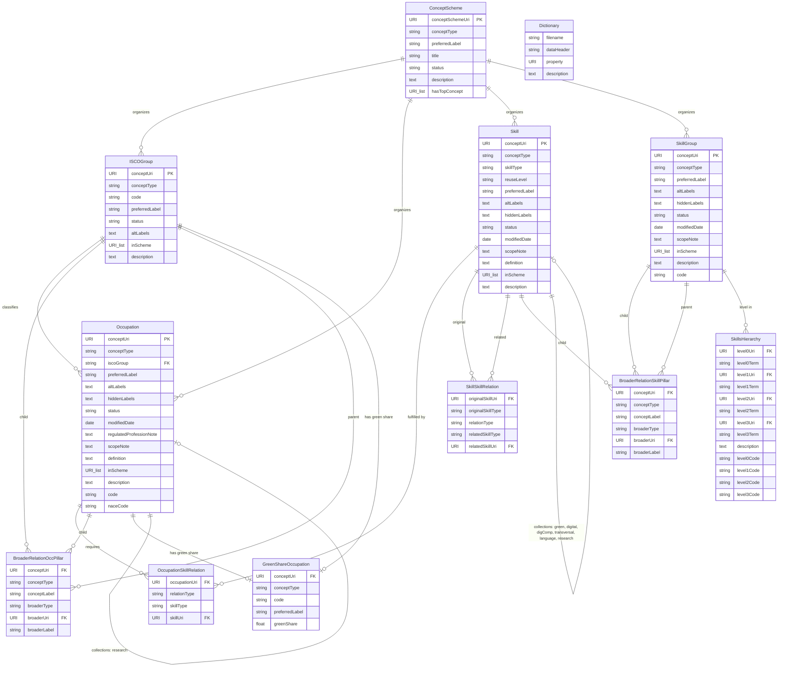

# ESCO Dataset v1.2.1 — Schema Reference

Source: `.local/ESCO dataset - v1.2.1 - classification - en - csv/`

ESCO (European Skills, Competences, Qualifications and Occupations) is the European multilingual classification of skills, competences and occupations. It provides a standardised taxonomy that connects occupations to the skills/competences and qualifications needed to perform them.

---

## Files & Entities

### 1. `occupations_en.csv` — Occupation

The main occupation catalogue. Each row is an ESCO occupation linked to an ISCO group.

| Column | Type | Examples |
|---|---|---|
| conceptType | string (enum) | `Occupation` |
| conceptUri | URI | `http://data.europa.eu/esco/occupation/00030d09-2b3a-4efd-87cc-c4ea39d27c34` |
| iscoGroup | string (code) | `2654`, `2632` |
| preferredLabel | string | `technical director`, `criminologist` |
| altLabels | text (pipe-delimited) | `director of technical arts \| technical supervisor` |
| hiddenLabels | text (pipe-delimited) | *(mostly empty)* |
| status | string (enum) | `released` |
| modifiedDate | date | `2024-08-01` |
| regulatedProfessionNote | text | *(optional note)* |
| scopeNote | text | *(optional scope clarification)* |
| definition | text | *(optional short definition)* |
| inScheme | URI list (comma-separated) | `http://data.europa.eu/esco/concept-scheme/occupations` |
| description | text | Long description of the occupation |
| code | string | `2654.2`, `2632.4` |
| naceCode | string | *(optional NACE industry code)* |

---

### 2. `skills_en.csv` — Skill

The main skills/knowledge/competence catalogue.

| Column | Type | Examples |
|---|---|---|
| conceptType | string (enum) | `KnowledgeSkillCompetence` |
| conceptUri | URI | `http://data.europa.eu/esco/skill/0005c151-5b5a-4a66-8aac-60e734beb1ab` |
| skillType | string (enum) | `skill/competence`, `knowledge` |
| reuseLevel | string (enum) | `sector-specific`, `cross-sector`, `transversal` |
| preferredLabel | string | `manage musical staff`, `Haskell` |
| altLabels | text (pipe-delimited) | `manage music staff \| coordinate duties of musical staff` |
| hiddenLabels | text (pipe-delimited) | *(mostly empty)* |
| status | string (enum) | `released` |
| modifiedDate | date | `2024-08-01` |
| scopeNote | text | *(optional)* |
| definition | text | *(optional short definition)* |
| inScheme | URI list | `http://data.europa.eu/esco/concept-scheme/skills` |
| description | text | Long description of the skill |

---

### 3. `ISCOGroups_en.csv` — ISCOGroup

ISCO-08 occupation groups (the hierarchical classification system occupations are mapped into).

| Column | Type | Examples |
|---|---|---|
| conceptType | string (enum) | `ISCOGroup` |
| conceptUri | URI | `http://data.europa.eu/esco/isco/C0` |
| code | string | `0`, `011`, `0110` |
| preferredLabel | string | `Armed forces occupations`, `Commissioned armed forces officers` |
| status | string (enum) | `released` |
| altLabels | text | *(mostly empty)* |
| inScheme | URI list | `http://data.europa.eu/esco/concept-scheme/occupations, .../isco` |
| description | text | Long description of the ISCO group |

---

### 4. `skillGroups_en.csv` — SkillGroup

Hierarchical grouping of skills, aligned to ISCED-F (Fields of Education and Training).

| Column | Type | Examples |
|---|---|---|
| conceptType | string (enum) | `SkillGroup` |
| conceptUri | URI | `http://data.europa.eu/esco/isced-f/00` |
| preferredLabel | string | `generic programmes and qualifications` |
| altLabels | text | *(mostly empty)* |
| hiddenLabels | text | *(mostly empty)* |
| status | string (enum) | `released` |
| modifiedDate | date | |
| scopeNote | text | *(optional)* |
| inScheme | URI list | `http://data.europa.eu/esco/concept-scheme/skills-hierarchy` |
| description | text | Long description of the skill group |
| code | string | `00`, `000`, `0000` |

---

### 5. `occupationSkillRelations_en.csv` — OccupationSkillRelation

Links occupations to the skills they require (essential or optional).

| Column | Type | Examples |
|---|---|---|
| occupationUri | URI | `http://data.europa.eu/esco/occupation/00030d09-...` |
| occupationLabel | string | `technical director` |
| relationType | string (enum) | `essential`, `optional` |
| skillType | string (enum) | `knowledge`, `skill/competence` |
| skillUri | URI | `http://data.europa.eu/esco/skill/fed5b267-...` |
| skillLabel | string | `theatre techniques`, `organise rehearsals` |

---

### 6. `skillSkillRelations_en.csv` — SkillSkillRelation

Links skills to related skills (e.g. a competence that optionally requires a knowledge area).

| Column | Type | Examples |
|---|---|---|
| originalSkillUri | URI | `http://data.europa.eu/esco/skill/00064735-...` |
| originalSkillType | string (enum) | `skill/competence` |
| relationType | string (enum) | `optional` |
| relatedSkillType | string (enum) | `knowledge` |
| relatedSkillUri | URI | `http://data.europa.eu/esco/skill/d4a0744a-...` |

---

### 7. `broaderRelationsOccPillar_en.csv` — BroaderRelationOccPillar

Parent-child hierarchy within the occupation pillar (ISCO groups and occupations).

| Column | Type | Examples |
|---|---|---|
| conceptType | string (enum) | `ISCOGroup`, `Occupation` |
| conceptUri | URI | `http://data.europa.eu/esco/isco/C01` |
| conceptLabel | string | `Commissioned armed forces officers` |
| broaderType | string (enum) | `ISCOGroup` |
| broaderUri | URI | `http://data.europa.eu/esco/isco/C0` |
| broaderLabel | string | `Armed forces occupations` |

---

### 8. `broaderRelationsSkillPillar_en.csv` — BroaderRelationSkillPillar

Parent-child hierarchy within the skill pillar (skill groups and individual skills).

| Column | Type | Examples |
|---|---|---|
| conceptType | string (enum) | `SkillGroup`, `KnowledgeSkillCompetence` |
| conceptUri | URI | `http://data.europa.eu/esco/isced-f/00` |
| conceptLabel | string | `generic programmes and qualifications` |
| broaderType | string (enum) | `SkillGroup` |
| broaderUri | URI | `http://data.europa.eu/esco/skill/c46fcb45-...` |
| broaderLabel | string | `knowledge` |

---

### 9. `skillsHierarchy_en.csv` — SkillsHierarchy

A denormalized 4-level hierarchy of skills (Level 0 → 1 → 2 → 3) with codes.

| Column | Type | Examples |
|---|---|---|
| Level 0 URI | URI | `http://data.europa.eu/esco/skill/e35a5936-...` |
| Level 0 preferred term | string | `language skills and knowledge` |
| Level 1 URI | URI (nullable) | `http://data.europa.eu/esco/skill/43f425aa-...` |
| Level 1 preferred term | string (nullable) | `languages` |
| Level 2 URI | URI (nullable) | |
| Level 2 preferred term | string (nullable) | |
| Level 3 URI | URI (nullable) | |
| Level 3 preferred term | string (nullable) | |
| Description | text | Long description |
| Scope note | text | *(optional)* |
| Level 0 code | string | `L` |
| Level 1 code | string (nullable) | `L1` |
| Level 2 code | string (nullable) | |
| Level 3 code | string (nullable) | |

---

### 10. `conceptSchemes_en.csv` — ConceptScheme

Top-level concept schemes that organize the taxonomy (e.g. "occupations", "skills", "digital").

| Column | Type | Examples |
|---|---|---|
| conceptType | string (enum) | `ConceptScheme` |
| conceptSchemeUri | URI | `http://data.europa.eu/esco/concept-scheme/6c930acd-...` |
| preferredLabel | string | `Digital` |
| title | string | *(optional)* |
| status | string (enum) | `released` |
| description | text | *(optional)* |
| hasTopConcept | URI list (comma-separated) | list of top-level concept URIs |

---

### 11. `greenShareOcc_en.csv` — GreenShareOccupation

"Green share" percentage for occupations — how much of an occupation's skill profile relates to green/sustainability skills.

| Column | Type | Examples |
|---|---|---|
| conceptType | string (enum) | `ISCO level 3`, `ISCO level 4`, `Occupation` |
| conceptUri | URI | `http://data.europa.eu/esco/isco/C011` |
| code | string | `011`, `0110`, `0110.1` |
| preferredLabel | string | `Commissioned armed forces officers`, `air force officer` |
| greenShare | float | `0.00575396825396825`, `0.0` |

---

### 12. `dictionary_en.csv` — Dictionary

Metadata dictionary describing the columns/properties used across all ESCO CSV files.

| Column | Type | Examples |
|---|---|---|
| filename | string | `occupations`, `skills` |
| data header | string | `conceptType`, `conceptUri`, `iscoGroup` |
| property | URI | `http://www.w3.org/2004/02/skos/core#notation` |
| description | text | `A notation, also known as classification code...` |

---

### 13. `greenSkillsCollection_en.csv` — GreenSkillsCollection

Subset of skills tagged as "green" (sustainability-related).

| Column | Type | Examples |
|---|---|---|
| conceptType | string (enum) | `KnowledgeSkillCompetence` |
| conceptUri | URI | `http://data.europa.eu/esco/skill/001d46db-...` |
| preferredLabel | string | `train staff to reduce food waste` |
| status | string (enum) | `released` |
| skillType | string (enum) | `skill/competence`, `knowledge` |
| reuseLevel | string (enum) | `sector-specific`, `cross-sector` |
| altLabels | text (pipe-delimited) | `teach students food waste reduction practices` |
| description | text | Long description |
| broaderConceptUri | URI list (pipe-delimited) | parent concept URIs |
| broaderConceptPT | text (pipe-delimited) | parent concept labels |

---

### 14. `digitalSkillsCollection_en.csv` — DigitalSkillsCollection

Subset of skills tagged as digital/IT-related.

| Column | Type | Examples |
|---|---|---|
| conceptType | string (enum) | `KnowledgeSkillCompetence` |
| conceptUri | URI | `http://data.europa.eu/esco/skill/000f1d3d-...` |
| preferredLabel | string | `Haskell`, `incremental development`, `KDevelop` |
| status | string (enum) | `released` |
| skillType | string (enum) | `knowledge`, `skill/competence` |
| reuseLevel | string (enum) | `sector-specific`, `cross-sector` |
| altLabels | text (pipe-delimited) | `Haskell techniques` |
| description | text | Long description |
| broaderConceptUri | URI list (pipe-delimited) | parent concept URIs |
| broaderConceptPT | text (pipe-delimited) | parent concept labels |

---

### 15. `digCompSkillsCollection_en.csv` — DigCompSkillsCollection

Skills from the DigComp (Digital Competence) framework — a subset of digital skills aligned to the EU DigComp reference.

| Column | Type | Examples |
|---|---|---|
| conceptType | string (enum) | `KnowledgeSkillCompetence` |
| conceptUri | URI | `http://data.europa.eu/esco/skill/14832d87-...` |
| preferredLabel | string | `solve technical problems`, `use e-services` |
| status | string (enum) | `released` |
| skillType | string (enum) | `skill/competence` |
| reuseLevel | string (enum) | `cross-sector` |
| altLabels | text (pipe-delimited) | `resolve technical issues \| diagnose technical problems` |
| description | text | Long description |
| broaderConceptUri | URI list (pipe-delimited) | parent concept URIs |
| broaderConceptPT | text (pipe-delimited) | parent concept labels |

---

### 16. `transversalSkillsCollection_en.csv` — TransversalSkillsCollection

Skills classified as transversal (applicable across all sectors and occupations).

| Column | Type | Examples |
|---|---|---|
| conceptType | string (enum) | `KnowledgeSkillCompetence` |
| conceptUri | URI | `http://data.europa.eu/esco/skill/001115fb-...` |
| skillType | string (enum) | `skill/competence`, `knowledge` |
| reuseLevel | string (enum) | `transversal` |
| preferredLabel | string | `show initiative`, `advise others` |
| status | string (enum) | `released` |
| altLabels | text (pipe-delimited) | `initiate action \| be a driving force` |
| description | text | Long description |
| broaderConceptUri | URI list (pipe-delimited) | parent concept URIs |
| broaderConceptPT | text (pipe-delimited) | parent concept labels |

---

### 17. `languageSkillsCollection_en.csv` — LanguageSkillsCollection

Skills related to language proficiency (reading, writing, speaking, listening per language).

| Column | Type | Examples |
|---|---|---|
| conceptType | string (enum) | `KnowledgeSkillCompetence` |
| conceptUri | URI | `http://data.europa.eu/esco/skill/01f10952-...` |
| skillType | string (enum) | `skill/competence`, `knowledge` |
| reuseLevel | string (enum) | `transversal` |
| preferredLabel | string | `write Hungarian`, `understand spoken Luxembourgish` |
| status | string (enum) | `released` |
| altLabels | text (pipe-delimited) | `correspond in written Hungarian` |
| description | text | Short description |
| broaderConceptUri | URI | parent language concept URI |
| broaderConceptPT | string | `Hungarian`, `Luxembourgish` |

---

### 18. `researchOccupationsCollection_en.csv` — ResearchOccupationsCollection

Subset of occupations tagged as research-oriented.

| Column | Type | Examples |
|---|---|---|
| conceptType | string (enum) | `Occupation` |
| conceptUri | URI | `http://data.europa.eu/esco/occupation/01ffb917-...` |
| preferredLabel | string | `biomedical engineer`, `criminologist`, `economics lecturer` |
| status | string (enum) | `released` |
| altLabels | text (pipe-delimited) | `biomedical technology engineering specialist \| BME consultant` |
| description | text | Long description |
| broaderConceptUri | URI | parent occupation/ISCO URI |
| broaderConceptPT | string | `bioengineer`, `higher education lecturer` |

---

### 19. `researchSkillsCollection_en.csv` — ResearchSkillsCollection

Subset of skills tagged as research-related.

| Column | Type | Examples |
|---|---|---|
| conceptType | string (enum) | `KnowledgeSkillCompetence` |
| conceptUri | URI | `http://data.europa.eu/esco/skill/00b9a3aa-...` |
| preferredLabel | string | `draft scientific or academic papers...`, `manage research data` |
| status | string (enum) | `released` |
| skillType | string (enum) | `skill/competence`, `knowledge` |
| reuseLevel | string (enum) | `cross-sector` |
| altLabels | text (pipe-delimited) | `create technical documentation` |
| description | text | Long description |
| broaderConceptUri | URI list (pipe-delimited) | parent concept URIs |
| broaderConceptPT | text (pipe-delimited) | parent concept labels |

---

## Entity-Relationship Diagram

### Collection Files (subsets, not separate entities)

The following files share the same structure as `Skill` (with `broaderConceptUri`/`broaderConceptPT` denormalized) and represent **tagged subsets** — not distinct entity types:

| File | Collection | Subset of |
|---|---|---|
| `greenSkillsCollection_en.csv` | Green Skills | Skill |
| `digitalSkillsCollection_en.csv` | Digital Skills | Skill |
| `digCompSkillsCollection_en.csv` | DigComp Skills | Skill |
| `transversalSkillsCollection_en.csv` | Transversal Skills | Skill |
| `languageSkillsCollection_en.csv` | Language Skills | Skill |
| `researchSkillsCollection_en.csv` | Research Skills | Skill |
| `researchOccupationsCollection_en.csv` | Research Occupations | Occupation |
