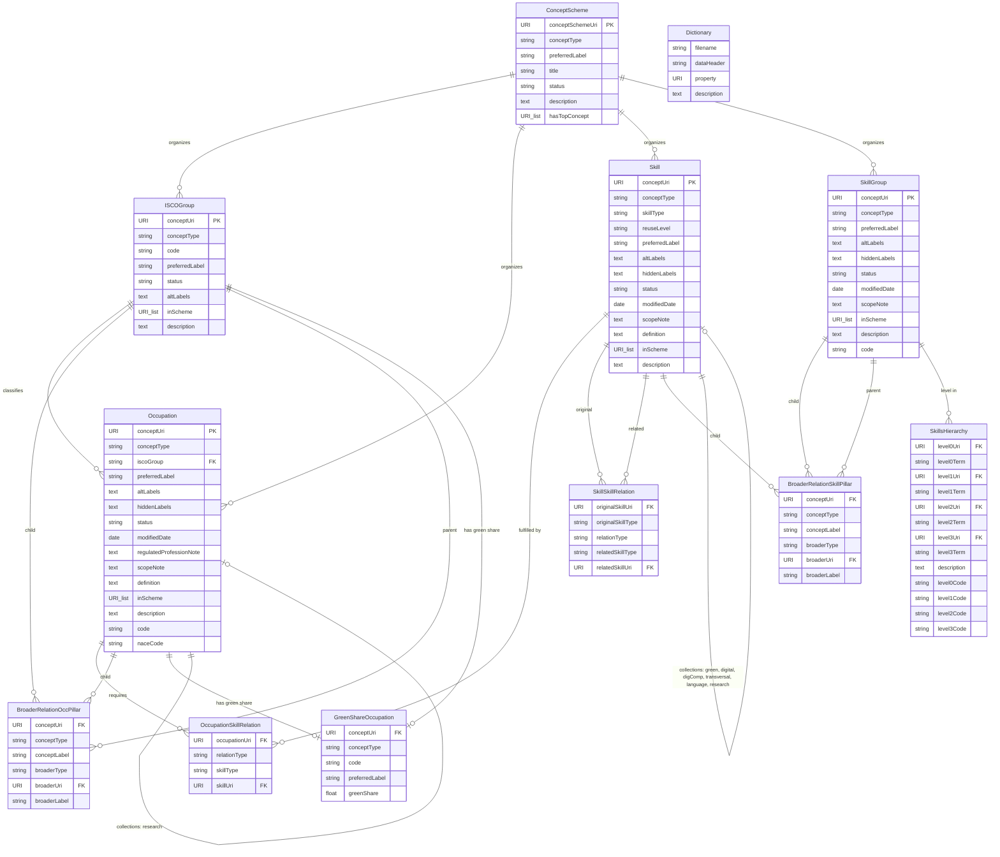

# ESCO Import Pipeline

Dataset: **ESCO v1.2.1** (European Skills, Competences, Qualifications and Occupations)

ESCO is the European multilingual classification of skills, competences and occupations. It provides a standardised taxonomy that connects occupations to the skills/competences and qualifications needed to perform them.

This module loads the ESCO CSV dataset, validates it against Zod schemas, and bulk-imports it into PostgreSQL.

## CLI Usage

```bash
bun esco:import <path-to-esco-directory>
```

The directory must contain all 19 CSV files from the ESCO v1.2.1 English classification export (e.g. `esco-dataset-v1.2.1-classification-en-csv/`).

## Pipeline Stages

### Stage 1: Directory validation (`EscoDirectoryLoader`)

Scans a directory, verifies all 19 expected CSV files are present, and returns an `EscoDirectory` object mapping camelCase keys to absolute file paths. Throws `ZodError` if any file is missing.

### Stage 2: CSV parsing (`EscoCsvParser` + `EscoDatasetParser`)

`EscoCsvParser` is a generic parser that reads one CSV file, validates every row against a Zod schema, and returns typed arrays. It handles:

- Empty CSV cells to `undefined` conversion (CSV empty strings vs Zod `.optional()`)
- Column order independence (zod-csv maps positionally, so the parser builds extraction schemas matching CSV header order)
- Multiline quoted fields (altLabels, scope notes, descriptions contain newlines)
- Type coercion (`z.coerce.number()` for `greenShare`)

`EscoDatasetParser` orchestrates all 19 files in parallel via `Promise.all`, returning a fully typed `EscoDataset`.

### Stage 3: Database import (`EscoImporter`)

`EscoImporter` performs idempotent bulk import via raw SQL with `INSERT ... ON CONFLICT DO UPDATE`. Skills hierarchy uses DELETE + INSERT (no natural unique key). Batches of 500 rows. Logs per-table row counts and duration.

## Zod Schemas (14 schemas for 19 files)

| Schema | Files it validates |
|---|---|
| `SkillSchema` | `skills_en.csv` |
| `OccupationSchema` | `occupations_en.csv` |
| `ISCOGroupSchema` | `ISCOGroups_en.csv` |
| `SkillGroupSchema` | `skillGroups_en.csv` |
| `OccupationSkillRelationSchema` | `occupationSkillRelations_en.csv` |
| `SkillSkillRelationSchema` | `skillSkillRelations_en.csv` |
| `BroaderRelationOccPillarSchema` | `broaderRelationsOccPillar_en.csv` |
| `BroaderRelationSkillPillarSchema` | `broaderRelationsSkillPillar_en.csv` |
| `ConceptSchemeSchema` | `conceptSchemes_en.csv` |
| `DictionarySchema` | `dictionary_en.csv` |
| `SkillsHierarchySchema` | `skillsHierarchy_en.csv` |
| `GreenShareOccupationSchema` | `greenShareOcc_en.csv` |
| `SkillCollectionSchema` | 6 files: `greenSkills`, `digitalSkills`, `digCompSkills`, `transversalSkills`, `languageSkills`, `researchSkills` |
| `OccupationCollectionSchema` | `researchOccupationsCollection_en.csv` |

## Database Tables

14 PostgreSQL tables created via `Migration_20260506000000_create_esco_tables`:

**Concept tables** (PK = `concept_uri` text, with `esco_version`, `created_at`, `updated_at`):
- `esco_skills`, `esco_occupations`, `esco_isco_groups`, `esco_skill_groups`
- `esco_concept_schemes` (PK = `concept_scheme_uri`)
- `esco_dictionary` (composite PK: `filename`, `data_header`)

**Relationship tables** (composite PKs, no timestamps):
- `esco_occupation_skill_relations` (FK to occupations + skills)
- `esco_skill_skill_relations` (FK to skills x2)
- `esco_broader_relations_occ_pillar`, `esco_broader_relations_skill_pillar` (polymorphic, no FK)
- `esco_skills_hierarchy` (auto-increment PK)

**Collection tables:**
- `esco_skill_collections` (composite PK: `concept_uri` + `collection_type`, FK to skills)
- `esco_occupation_collections` (FK to occupations)
- `esco_green_share_occupations` (polymorphic, no FK)

## CSV Schema Reference

### 1. `occupations_en.csv` — Occupation

The main occupation catalogue. Each row is an ESCO occupation linked to an ISCO group.

| Column | Type | Examples |
|---|---|---|
| conceptType | string (enum) | `Occupation` |
| conceptUri | URI | `http://data.europa.eu/esco/occupation/00030d09-2b3a-4efd-87cc-c4ea39d27c34` |
| iscoGroup | string (code) | `2654`, `2632` |
| preferredLabel | string | `technical director`, `criminologist` |
| altLabels | text (pipe-delimited) | `director of technical arts \| technical supervisor` |
| hiddenLabels | text (pipe-delimited) | *(mostly empty)* |
| status | string (enum) | `released` |
| modifiedDate | date | `2024-08-01` |
| regulatedProfessionNote | text | *(optional note)* |
| scopeNote | text | *(optional scope clarification)* |
| definition | text | *(optional short definition)* |
| inScheme | URI list (comma-separated) | `http://data.europa.eu/esco/concept-scheme/occupations` |
| description | text | Long description of the occupation |
| code | string | `2654.2`, `2632.4` |
| naceCode | string | *(optional NACE industry code)* |

### 2. `skills_en.csv` — Skill

The main skills/knowledge/competence catalogue.

| Column | Type | Examples |
|---|---|---|
| conceptType | string (enum) | `KnowledgeSkillCompetence` |
| conceptUri | URI | `http://data.europa.eu/esco/skill/0005c151-5b5a-4a66-8aac-60e734beb1ab` |
| skillType | string (enum) | `skill/competence`, `knowledge` |
| reuseLevel | string (enum) | `sector-specific`, `cross-sector`, `transversal` |
| preferredLabel | string | `manage musical staff`, `Haskell` |
| altLabels | text (pipe-delimited) | `manage music staff \| coordinate duties of musical staff` |
| hiddenLabels | text (pipe-delimited) | *(mostly empty)* |
| status | string (enum) | `released` |
| modifiedDate | date | `2024-08-01` |
| scopeNote | text | *(optional)* |
| definition | text | *(optional short definition)* |
| inScheme | URI list | `http://data.europa.eu/esco/concept-scheme/skills` |
| description | text | Long description of the skill |

### 3. `ISCOGroups_en.csv` — ISCOGroup

ISCO-08 occupation groups (the hierarchical classification system occupations are mapped into).

| Column | Type | Examples |
|---|---|---|
| conceptType | string (enum) | `ISCOGroup` |
| conceptUri | URI | `http://data.europa.eu/esco/isco/C0` |
| code | string | `0`, `011`, `0110` |
| preferredLabel | string | `Armed forces occupations`, `Commissioned armed forces officers` |
| status | string (enum) | `released` |
| altLabels | text | *(mostly empty)* |
| inScheme | URI list | `http://data.europa.eu/esco/concept-scheme/occupations, .../isco` |
| description | text | Long description of the ISCO group |

### 4. `skillGroups_en.csv` — SkillGroup

Hierarchical grouping of skills, aligned to ISCED-F (Fields of Education and Training).

| Column | Type | Examples |
|---|---|---|
| conceptType | string (enum) | `SkillGroup` |
| conceptUri | URI | `http://data.europa.eu/esco/isced-f/00` |
| preferredLabel | string | `generic programmes and qualifications` |
| altLabels | text | *(mostly empty)* |
| hiddenLabels | text | *(mostly empty)* |
| status | string (enum) | `released` |
| modifiedDate | date | |
| scopeNote | text | *(optional)* |
| inScheme | URI list | `http://data.europa.eu/esco/concept-scheme/skills-hierarchy` |
| description | text | Long description of the skill group |
| code | string | `00`, `000`, `0000` |

### 5. `occupationSkillRelations_en.csv` — OccupationSkillRelation

Links occupations to the skills they require (essential or optional).

| Column | Type | Examples |
|---|---|---|
| occupationUri | URI | `http://data.europa.eu/esco/occupation/00030d09-...` |
| occupationLabel | string | `technical director` |
| relationType | string (enum) | `essential`, `optional` |
| skillType | string (enum) | `knowledge`, `skill/competence` |
| skillUri | URI | `http://data.europa.eu/esco/skill/fed5b267-...` |
| skillLabel | string | `theatre techniques`, `organise rehearsals` |

### 6. `skillSkillRelations_en.csv` — SkillSkillRelation

Links skills to related skills (e.g. a competence that optionally requires a knowledge area).

| Column | Type | Examples |
|---|---|---|
| originalSkillUri | URI | `http://data.europa.eu/esco/skill/00064735-...` |
| originalSkillType | string (enum) | `skill/competence` |
| relationType | string (enum) | `optional` |
| relatedSkillType | string (enum) | `knowledge` |
| relatedSkillUri | URI | `http://data.europa.eu/esco/skill/d4a0744a-...` |

### 7. `broaderRelationsOccPillar_en.csv` — BroaderRelationOccPillar

Parent-child hierarchy within the occupation pillar (ISCO groups and occupations).

| Column | Type | Examples |
|---|---|---|
| conceptType | string (enum) | `ISCOGroup`, `Occupation` |
| conceptUri | URI | `http://data.europa.eu/esco/isco/C01` |
| conceptLabel | string | `Commissioned armed forces officers` |
| broaderType | string (enum) | `ISCOGroup` |
| broaderUri | URI | `http://data.europa.eu/esco/isco/C0` |
| broaderLabel | string | `Armed forces occupations` |

### 8. `broaderRelationsSkillPillar_en.csv` — BroaderRelationSkillPillar

Parent-child hierarchy within the skill pillar (skill groups and individual skills).

| Column | Type | Examples |
|---|---|---|
| conceptType | string (enum) | `SkillGroup`, `KnowledgeSkillCompetence` |
| conceptUri | URI | `http://data.europa.eu/esco/isced-f/00` |
| conceptLabel | string | `generic programmes and qualifications` |
| broaderType | string (enum) | `SkillGroup` |
| broaderUri | URI | `http://data.europa.eu/esco/skill/c46fcb45-...` |
| broaderLabel | string | `knowledge` |

### 9. `skillsHierarchy_en.csv` — SkillsHierarchy

A denormalized 4-level hierarchy of skills (Level 0 to 3) with codes.

| Column | Type | Examples |
|---|---|---|
| Level 0 URI | URI | `http://data.europa.eu/esco/skill/e35a5936-...` |
| Level 0 preferred term | string | `language skills and knowledge` |
| Level 1 URI | URI (nullable) | `http://data.europa.eu/esco/skill/43f425aa-...` |
| Level 1 preferred term | string (nullable) | `languages` |
| Level 2 URI | URI (nullable) | |
| Level 2 preferred term | string (nullable) | |
| Level 3 URI | URI (nullable) | |
| Level 3 preferred term | string (nullable) | |
| Description | text | Long description |
| Scope note | text | *(optional)* |
| Level 0 code | string | `L` |
| Level 1 code | string (nullable) | `L1` |
| Level 2 code | string (nullable) | |
| Level 3 code | string (nullable) | |

### 10. `conceptSchemes_en.csv` — ConceptScheme

Top-level concept schemes that organize the taxonomy (e.g. "occupations", "skills", "digital").

| Column | Type | Examples |
|---|---|---|
| conceptType | string (enum) | `ConceptScheme` |
| conceptSchemeUri | URI | `http://data.europa.eu/esco/concept-scheme/6c930acd-...` |
| preferredLabel | string | `Digital` |
| title | string | *(optional)* |
| status | string (enum) | `released` |
| description | text | *(optional)* |
| hasTopConcept | URI list (comma-separated) | list of top-level concept URIs |

### 11. `greenShareOcc_en.csv` — GreenShareOccupation

"Green share" percentage for occupations — how much of an occupation's skill profile relates to green/sustainability skills.

| Column | Type | Examples |
|---|---|---|
| conceptType | string (enum) | `ISCO level 3`, `ISCO level 4`, `Occupation` |
| conceptUri | URI | `http://data.europa.eu/esco/isco/C011` |
| code | string | `011`, `0110`, `0110.1` |
| preferredLabel | string | `Commissioned armed forces officers`, `air force officer` |
| greenShare | float | `0.00575396825396825`, `0.0` |

### 12. `dictionary_en.csv` — Dictionary

Metadata dictionary describing the columns/properties used across all ESCO CSV files.

| Column | Type | Examples |
|---|---|---|
| filename | string | `occupations`, `skills` |
| data header | string | `conceptType`, `conceptUri`, `iscoGroup` |
| property | URI | `http://www.w3.org/2004/02/skos/core#notation` |
| description | text | `A notation, also known as classification code...` |

### 13-17. Skill Collection Files

Six files share the `SkillCollectionSchema` structure. They represent tagged subsets of skills, not distinct entity types.

| File | Collection |
|---|---|
| `greenSkillsCollection_en.csv` | Green Skills |
| `digitalSkillsCollection_en.csv` | Digital Skills |
| `digCompSkillsCollection_en.csv` | DigComp Skills |
| `transversalSkillsCollection_en.csv` | Transversal Skills |
| `languageSkillsCollection_en.csv` | Language Skills |
| `researchSkillsCollection_en.csv` | Research Skills |

Common columns: `conceptType`, `conceptUri`, `preferredLabel`, `status`, `skillType`, `reuseLevel`, `altLabels`, `description`, `broaderConceptUri` (pipe-delimited), `broaderConceptPT` (pipe-delimited).

### 18. `researchOccupationsCollection_en.csv` — OccupationCollection

Subset of occupations tagged as research-oriented. Uses `OccupationCollectionSchema`.

Columns: `conceptType`, `conceptUri`, `preferredLabel`, `status`, `altLabels`, `description`, `broaderConceptUri`, `broaderConceptPT`.

## Entity-Relationship Diagram



## File Inventory

```
infrastructure/src/esco/
├── README.md                ← This file
├── EscoCsvParseError.ts     ← Error class (file path + per-row ZodErrors)
├── EscoCsvParser.ts         ← Generic CSV-to-schema parser
├── EscoDataset.ts           ← Result type (19 readonly typed arrays)
├── EscoDatasetParser.ts     ← Orchestrator (parses all 19 files)
├── EscoDirectoryLoader.ts   ← Directory scanner + file validation
├── EscoImporter.ts          ← Bulk import to PostgreSQL (raw SQL, batched upserts)
├── index.ts                 ← Barrel exports
├── zod-csv.d.ts             ← Ambient types for zod-csv
├── entities/
│   ├── index.ts
│   ├── EscoBroaderRelationOccPillarEntity.ts
│   ├── EscoBroaderRelationSkillPillarEntity.ts
│   ├── EscoConceptSchemeEntity.ts
│   ├── EscoDictionaryEntity.ts
│   ├── EscoGreenShareOccupationEntity.ts
│   ├── EscoIscoGroupEntity.ts
│   ├── EscoOccupationCollectionEntity.ts
│   ├── EscoOccupationEntity.ts
│   ├── EscoOccupationSkillRelationEntity.ts
│   ├── EscoSkillCollectionEntity.ts
│   ├── EscoSkillEntity.ts
│   ├── EscoSkillGroupEntity.ts
│   ├── EscoSkillSkillRelationEntity.ts
│   └── EscoSkillsHierarchyEntity.ts
└── schemas/
    ├── broader-relation-occ-pillar.ts
    ├── broader-relation-skill-pillar.ts
    ├── concept-scheme.ts
    ├── dictionary.ts
    ├── green-share-occupation.ts
    ├── isco-group.ts
    ├── occupation.ts
    ├── occupation-collection.ts
    ├── occupation-skill-relation.ts
    ├── skill.ts
    ├── skill-collection.ts
    ├── skill-group.ts
    ├── skill-skill-relation.ts
    └── skills-hierarchy.ts
```

## Test Coverage

**Unit tests** (46 tests across 3 files):
- `EscoDirectoryLoader.test.ts` — 4 tests (file discovery, key mapping, missing files, bad directory)
- `EscoCsvParser.test.ts` — 35 tests (all 19 files parse, empty string handling, enum variants, type coercion, multiline fields, column order independence, error handling)
- `EscoDatasetParser.test.ts` — 7 tests (full dataset parse, typed field checks, collection consistency)

All unit tests run against fixture CSV files containing ~20 rows each from real ESCO data.

**Integration tests** (4 tests in `test-integration/esco/esco-import.test.ts`):
- Import populates all 14 tables
- Idempotency: running twice yields same row counts
- Collection type discriminator values are correct
- FK constraints exist on relationship tables

## Not Yet Implemented

- **No use case** — nothing in the application layer orchestrates or consumes the pipeline
- **No API trigger** — import is CLI-only
- **No embeddings or vector columns** — planned for a separate session
- **No DI wiring** — `EscoCsvParser` and `EscoDatasetParser` have `@injectable()` but are not bound in the composition root yet
