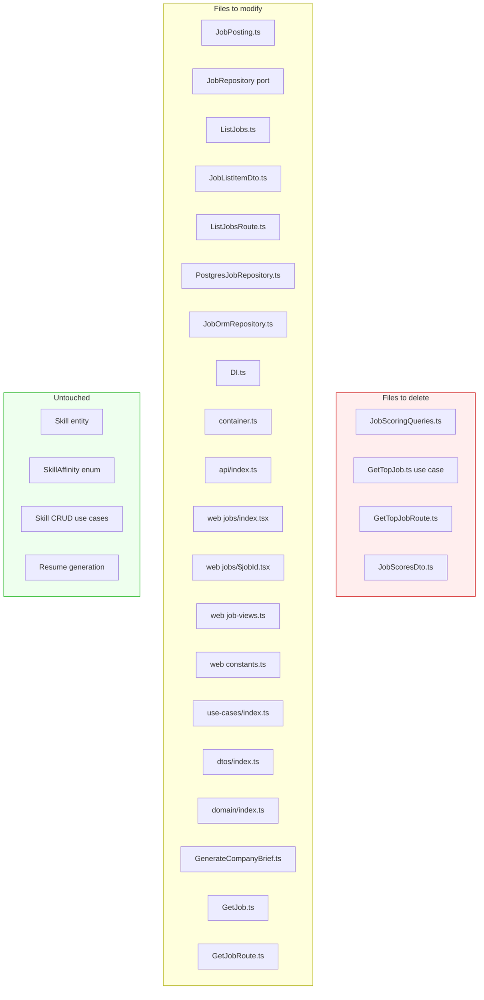

---
planStatus:
  planId: plan-remove-scoring-logic
  title: Remove Job Scoring Logic
  status: in-review
  startDate: "2026-03-31"
  planType: refactor
  priority: medium
  owner: sylvain
  stakeholders: []
  tags:
    - scoring
    - cleanup
    - refactor
  created: "2026-03-31"
  updated: "2026-03-31"
  progress: 100
---
# Remove Job Scoring Logic

Remove the skill-affinity-based scoring system that ranks jobs by weighted skill matches and salary. Skills and SkillAffinity remain (used for resume generation and skill CRUD). Only the scoring/ranking queries and their consumers are removed.

## Scope

## Steps

### Step 1 — Domain layer

**Files:**

| File | Action |
| --- | --- |
| `domain/src/entities/JobPosting.ts` | Remove `scores` field, `score()` method, `JobScores` type, `JobScoresSkillScore` type. Remove `scores?` from constructor props. Remove imports of `SkillAffinity` and `Skill`. |
| `domain/src/ports/JobRepository.ts` | Remove `findTopScored()`, `findScoredByIdOrFail()`. Remove `FindTopScoredParams`, `FindScoredParams`. Remove scoring weight params (`targetSalary`, `expertWeight`, `interestWeight`, `avoidWeight`) from `FindPaginatedParams`. Remove sort param if score sorting is removed. |
| `domain/src/index.ts` | Remove exports for `JobScores`, `JobScoresSkillScore` if exported. |

**Decisions:**
- `findPaginated` keeps `sort: string` but only supports `posted_at:asc` and `posted_at:desc`. Default changes to `posted_at:desc`.
- A new `findByIdWithCompanyOrFail(jobId)` method replaces `findScoredByIdOrFail` — returns `{ job, company }` without scores.

### Step 2 — Application layer

**Files:**

| File | Action |
| --- | --- |
| `application/src/use-cases/GetTopJob.ts` | **Delete file** |
| `application/src/dtos/JobScoresDto.ts` | **Delete file** |
| `application/src/dtos/JobListItemDto.ts` | Remove `expertScore`, `totalSkillScore`, `salaryScore` fields |
| `application/src/use-cases/ListJobs.ts` | Remove `targetSalary` from `ListJobsInput`. Remove score DTO mapping from `toJobListItemDto`. |
| `application/src/use-cases/GetJob.ts` | Remove `targetSalary` from `GetJobInput`. Call `findByIdWithCompanyOrFail` instead of `findScoredByIdOrFail`. |
| `application/src/use-cases/GenerateCompanyBrief.ts` | Switch from `findScoredByIdOrFail` to `findByIdWithCompanyOrFail`. |
| `application/src/use-cases/index.ts` | Remove `GetTopJob` export |
| `application/src/dtos/index.ts` | Remove `JobScoresDto` export |

**Test updates:**
- `application/test/use-cases/ListJobs.test.ts` — remove score expectations, remove `targetSalary` from input
- `application/test/use-cases/GetJob.test.ts` — remove `targetSalary` from input, update mock

### Step 3 — Infrastructure layer

**Files:**

| File | Action |
| --- | --- |
| `infrastructure/src/db/entities/jobs/JobScoringQueries.ts` | **Delete file** |
| `infrastructure/src/db/entities/jobs/JobOrmRepository.ts` | Remove `findScoredByIdOrFail`, `findTopScored`, scoring CTE calls from `findPaginatedScored`. Add `findByIdWithCompanyOrFail`. Remove scoring-related types (`JobScoresProps`, `JobListScoresProps`). Simplify `findPaginatedScored` → `findPaginated` (no scoring, just filter + sort by `posted_at`). |
| `infrastructure/src/repositories/PostgresJobRepository.ts` | Remove `findScoredByIdOrFail`, `findTopScored` methods. Remove `toDomainWithScores`, `toDomainWithListScores`, `mapScores` private methods. Remove imports: `JobScores`, `SkillAffinity`, `SkillId`, `OrmSkillAffinity`, `JobListScoresProps`, `JobScoresProps`. Add `findByIdWithCompanyOrFail`. Simplify `findPaginated` — no longer passes scoring weights. |
| `infrastructure/src/DI.ts` | Remove `GetTopJob` token and import |
| `infrastructure/test-integration/repositories/job-scoring.test.ts` | **Delete file** |

### Step 4 — API layer

**Files:**

| File | Action |
| --- | --- |
| `api/src/routes/GetTopJobRoute.ts` | **Delete file** |
| `api/src/routes/ListJobsRoute.ts` | Remove `target_salary` query param. Change default sort from `'score:desc'` to `'posted_at:desc'`. Remove `targetSalary` from use case input. |
| `api/src/routes/GetJobRoute.ts` | Remove `target_salary` query param. Remove `targetSalary` from use case input. |
| `api/src/index.ts` | Remove `GetTopJobRoute` import and `.use()` call |
| `api/src/container.ts` | Remove `GetTopJob` import and container binding |

### Step 5 — Web layer

**Files:**

| File | Action |
| --- | --- |
| `web/src/lib/job-views.ts` | Remove `'score'` from `defaultSort` type union. Change triage `defaultSort` to `'posted_at'`. |
| `web/src/lib/constants.ts` | Remove `DEFAULT_TARGET_SALARY` |
| `web/src/routes/jobs/index.tsx` | Remove Score column header + sort toggle. Remove `expertScore` cell. Remove `target_salary` from API query. Remove `DEFAULT_TARGET_SALARY` import. Adjust `colSpan`. |
| `web/src/routes/jobs/$jobId.tsx` | Remove Scores card section. Remove `ScoreItem` component. Remove `scores` extraction. Remove `BarChart3` icon import. |

### Step 6 — Cleanup & verification

- [ ] Remove `JobScoresDto` re-export from `application/src/dtos/index.ts`
- [ ] Run `bun run check` — fix any Biome lint/format errors
- [ ] Run `bun run knip` — verify no new dead code introduced
- [ ] Run `bun run dep:check` — verify dependency boundaries still clean
- [ ] Run `bun run --cwd domain typecheck` + `bun run --cwd application typecheck` + `bun run --cwd infrastructure typecheck` + `bun run --cwd api typecheck` + `bun run --cwd web typecheck`
- [ ] Run unit tests: `bun test` in application/
- [ ] Verify the web frontend builds: `bun run --cwd web build`

## Key decisions

1. **`findScoredByIdOrFail`**** → \****`findByIdWithCompanyOrFail`**: The new method simply joins job + company without scoring. Used by `GetJob` and `GenerateCompanyBrief`.
2. **Sort options**: Only `posted_at:asc` and `posted_at:desc` remain. All views default to `posted_at:desc`.
3. **No database migration needed**: Scoring was computed at query time via CTEs, not stored in columns. The `description_fts` tsvector column stays (may be useful for future search).
4. **Skills stay**: `Skill`, `SkillAffinity`, `SkillRepository`, and all skill CRUD operations are unaffected.
